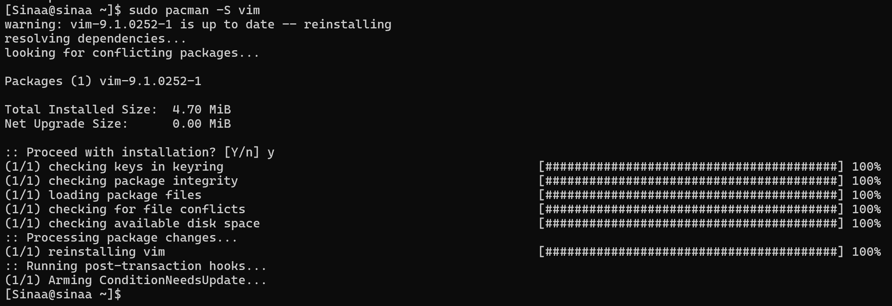

# nginx-tutorial

Hello
<br />
this is a tutorial for setting up nginx and an example html page

<br/>
<br/>
<h3>Step 1: Creating a Droplet</h3>
<p>
    first we need to create a droplet in digital ocean and log in to it
    we will be using an arch system for this tutorial
    example command for logging in using ssh and public key: 
    ssh -i C:\Users\abbas\.ssh\do-key Sinaa@146.190.125.148
</p>

<h3>Step 2: Installing the necessary applications</h3>
<p>
    We will be needing the following applications:
</p>
<h5>Vim</h5>
<p>
    Vim is a highly configurable text editor built to enable efficient text editing.
    
    <br />
    to install vim: 
    ```sh
    sudo pacman -S vim
    ```
    <br />
    
</p>
<h5>Nginx</h5>
<p>
    Nginx, pronounced "engine x," is a widely used open-source web server technology known for its high performance, scalability, and ability to handle a large number of concurrent requests efficiently.
    and we will be using it to serve our html page.
    
    <br />
    to install nginx: 
    sudo pacman -S nginx
    <br />
    and then we have to enable it using systemctl (so it will run automatically after system load):
    sudo systemctl enable nginx
    <br />
    now we should start the service:
    sudo sysetmctl start nginx
</p>